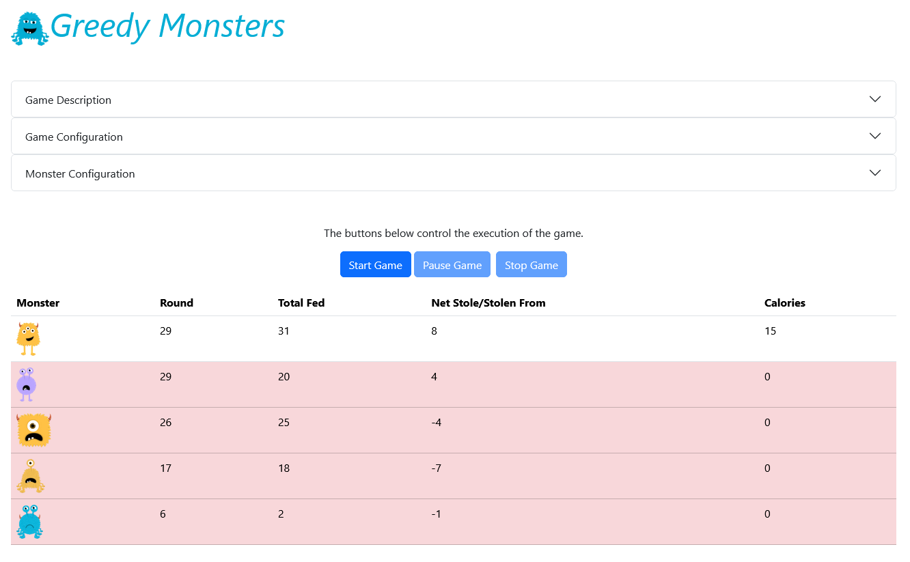
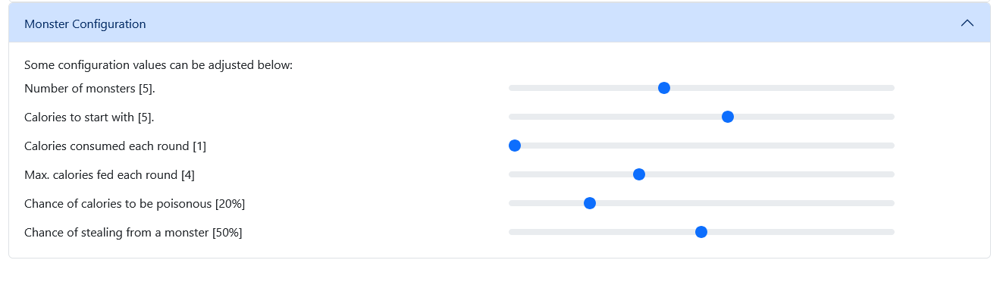
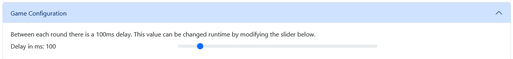

## Game Description

Greedy Monsters is a zero-player game in which a set number of monsters compete for calories.

When a monster has no calories left, it is dead. The last monster left after a round is the winner of the game. If no
monsters have any calories at the end of a round, no winner can be declared.

Each monster get 5* calories at the start of the game. The monsters will take turns in a round competing for
calories. For each round, the following steps will be performed for each monster:

1. A monster awakens and consumes one* calorie.
2. It is fed with an arbitrary number of calories between 1 and 3*.
3. There is a 20%* chance that these calories are toxic. If so, they are subtracted from the monster's
   calories.
4. There is a 50%* chance that this monster will steal half the calories of another sleeping monster. Only
   one monster can steal for in each round.
5. The monster goes back to sleep.

When a new round starts, the monster with the least calories will wake up first.

_* These values can be modified. See [Monster Configuration](#Monster-Configuration)._

### Monster Configuration

The following parameters can be configured at the start of a game:

- The number of monsters playing. Can be between 3 and 8. Default is 5.
- Calories to start with. Can be between 1 and 8. Default is 5.
- Calories consumed each round. Can be between 1 and 10. Default is 1.
- Maximum calories to be fed each round. Can be between 1 and 10. Default is 4.
- Chance of calories fed to be poisonous. Can be between 0% and 100%. Default is 20%.
- Chance of stealing calories from a monster. Can be between 0% and 100%. Default is 50%.

### Realtime Configuration

As the game is running quite fast without any timedelay between each round,
it can be configured. By default, it is 100ms, but it can be set between 0ms and 1s.
It can be changed while the game is running.

### Game controls

There are 3 buttons to control the game as shown in the image below.

## Getting started
1. Install [Node 22.20](https://nodejs.org/en/download) or later.
2. Clone this repository.
3. Install Node Packages with Dependencies. `npm install`
4. Start the project. `npm run dev`
5. Point your browser to: http://localhost:3110/greedy-monsters-react-tsx/

